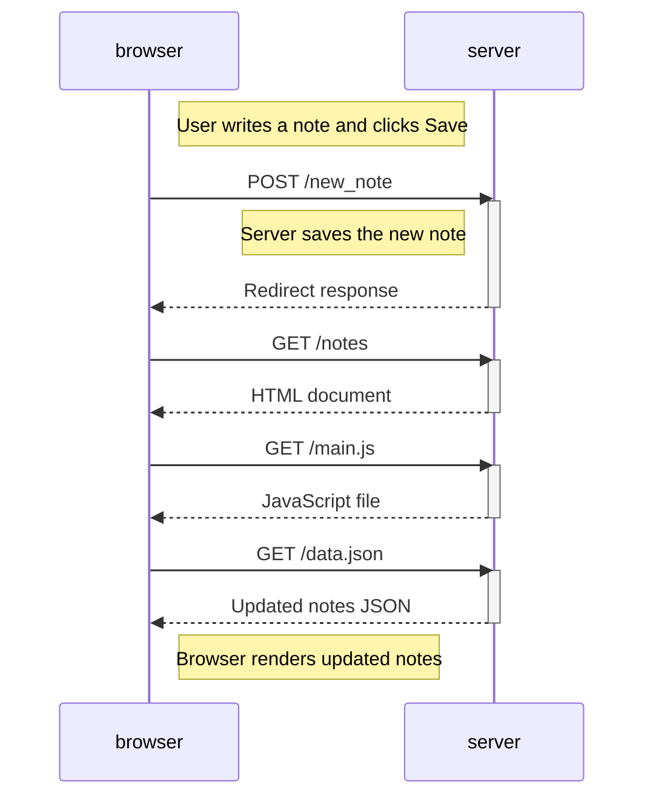

```mermaid
sequenceDiagram
    participant browser
    participant server

    Note right of browser: User writes a note and clicks Save

    browser->>server: POST /new_note
    activate server
    Note left of server: Server saves the new note
    server-->>browser: Redirect response
    deactivate server

    browser->>server: GET /notes
    activate server
    server-->>browser: HTML document
    deactivate server

    browser->>server: GET /main.js
    activate server
    server-->>browser: JavaScript file
    deactivate server

    browser->>server: GET /data.json
    activate server
    server-->>browser: Updated notes JSON
    deactivate server

    Note right of browser: Browser renders updated notes
```